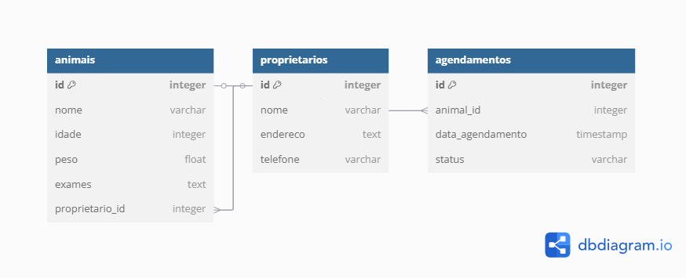

# modelagem-de-sistemas
Sistema de gestão para campanhas de castração popular.
## Documentação  
- [Relatório de Requisitos](/docs/relatorio.md)  
- [Diagramas](/docs/)  
## Modelo do Banco de Dados  
  
## Como Configurar o Banco de Dados

1. Execute o script `scripts/banco.sql` no seu MySQL:
   ```bash
   mysql -u usuario -p < scripts/banco.sql
   ```
2. Ou importe via PHPMyAdmin/MySQL Workbench.
